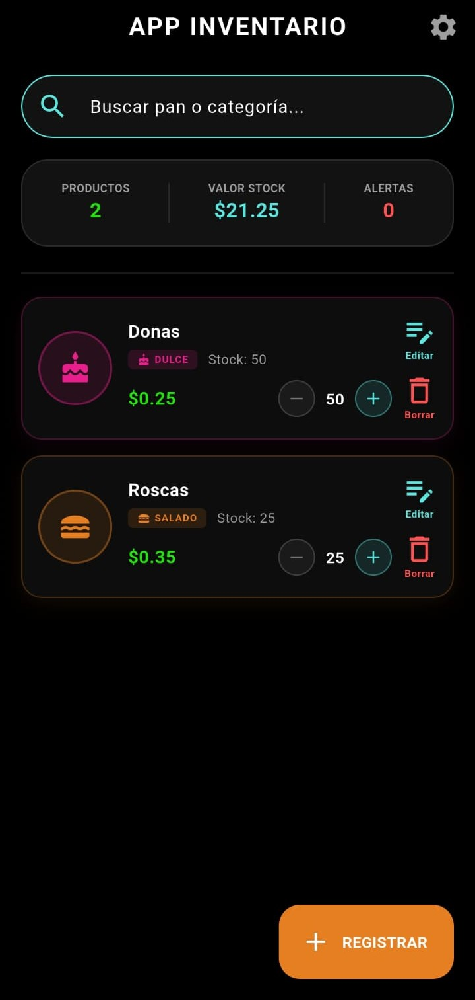
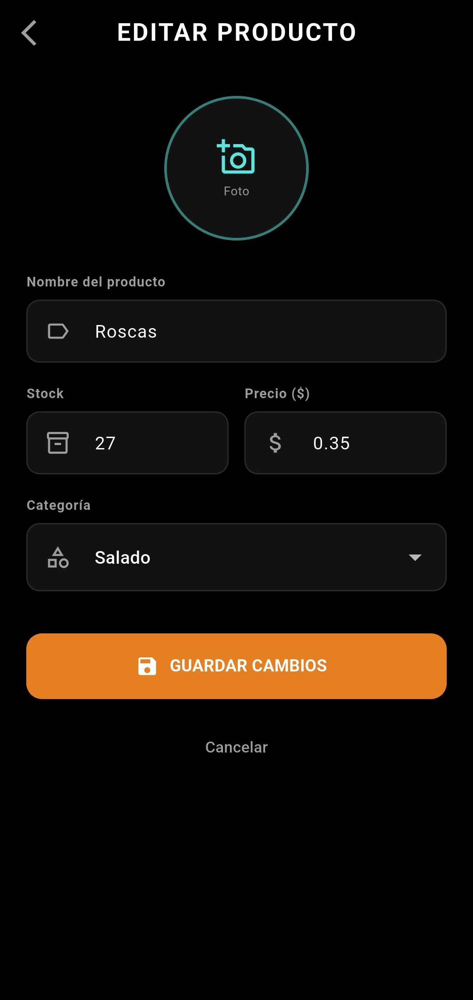

# 🥖 Inventario Panadería (app_inventario)

**Proyecto:** Gestión de Stock y Auditoría de Usabilidad (HCI)  
**Institución:** Universidad Politécnica Estatal del Carchi/ Maestria en ingeniería de software

¡Bienvenidos al repositorio oficial del proyecto! Esta aplicación está diseñada para ayudar a los panaderos a gestionar su producción diaria, controlar el stock de productos (cachitos, pan de bono, etc.) y visualizar precios en tiempo real.

---

## 📱 Vista Previa del Diseño

|     Inicio       | Registro | Editar | Gestión de Configuración |
| :---: | :---: | :---: |:---: |
|  |  |  |  |

> **Nota:** Las interfaces han sido diseñadas siguiendo las 10 heurísticas de Nielsen y la teoría de carga cognitiva de Sweller para optimizar la eficiencia operativa.

---

## 👥 Equipo y Roles
* **José (Arquitecto / Líder Técnico):** Estructura del proyecto, diseño de base de datos SQLite, liderazgo metodológico y despliegue.
* **Xavier (UI / Frontend):** Diseño de interfaces en Figma, creación de widgets reutilizables y componentes adaptativos.
* **Valeria (Analista / QA):** Definición del backlog, diccionario de datos, auditoría de accesibilidad (WCAG 2.2) y pruebas de calidad.

---
## 📐 Respaldo Metodológico
El desarrollo de **Inventario Panadería** sigue el modelo híbrido **Mobile-D + SCRUM**, optimizando el ciclo de vida móvil con gestión ágil:

1. **Exploración:** Definición de arquitectura (José).
2. **Producción (Sprints):** Desarrollo de pantallas (Xavier) y lógica de inventario (José).
3. **Estabilización:** Pruebas de carga cognitiva y QA (Valeria).

---
## 🛠️ Metodología de Desarrollo
El proyecto se rige bajo el marco de trabajo **Scrum**, con un enfoque en ingeniería de software de alta fidelidad:

1.  **Diseño Centrado en el Usuario (UCD):** Prototipado rápido y validación de flujos.
2.  **Arquitectura de Capas:** Separación estricta entre lógica de negocio, modelos y servicios de datos.
3.  **HCI & Computación Afectiva:** Implementación de interfaces que responden a la frustración del usuario (Proyecto Aura-UI).

---

## 🏗️ Estructura del Proyecto

Para mantener el código limpio y escalable, utilizamos la siguiente jerarquía:

* `lib/models/`: Definición de clases de datos (ej: `Producto.dart`).
* `lib/screens/`: Pantallas principales (Inventario, Registro, Detalles).
* `lib/services/`: Lógica de la base de datos SQLite y `DatabaseHelper`.
* `lib/widgets/`: Widgets reutilizables de UI (ej: `ProductCard`). *(Semana 2)*

---

## 🚀 Guía de Inicio para el Equipo

### 1. Clonación y Dependencias
Primero, clona el repositorio y descarga los paquetes necesarios:
```bash
git clone [https://github.com/tu-usuario/app_inventario.git](https://github.com/josstapia/App_Inventario.git)
cd app_inventario
flutter pub get
```

---

## 📅 Avance por Semanas

### ✅ Semana 1 — Exploración + Inicialización
- Definición de requisitos y arquitectura del proyecto.
- Configuración del entorno Flutter y dependencias.
- Prototipo inicial de pantallas.
- **Entregable:** Requisitos + arquitectura base.

---

### ✅ Semana 2 — Producción I (Core Funcional)

#### 🔧 Arquitecto / Líder Técnico
- Implementación de `DatabaseHelper` con SQLite (`sqflite`).
- Métodos CRUD: `upsert()`, `getAll()`, `delete()`.
- Modelo `Product` con soporte para imagen (`imagePath`).

#### 🎨 Developer UI / Frontend
Se construyeron 3 archivos nuevos de interfaz, conectados a la capa de datos de José:

**`lib/widgets/product_card.dart`**
- Widget reutilizable para mostrar cada producto en la lista.
- Colores e íconos únicos por categoría (Dulce, Salado, Pastelería, Bebida).
- Indicador visual de stock bajo (borde rojo cuando stock < 5).
- Botones `+` y `−` integrados para ajuste rápido de stock.

**`lib/screens/inventario_screen.dart`**
- Pantalla principal con `ListView` conectada a `DbHelper.instance.getAll()`.
- Dashboard con total de productos, valor de stock y contador de alertas.
- Barra de búsqueda en tiempo real por nombre o categoría.
- Estado vacío con mensaje cuando no hay productos registrados.

**`lib/screens/add_product_screen.dart`**
- Formulario de registro y edición como pantalla independiente.
- Validaciones: nombre obligatorio, stock no negativo, precio mayor a 0.
- Selector de imagen desde galería.
- Funciona tanto para crear nuevos productos como para editar existentes (recibe `Product?` opcional).
- Guarda usando `DbHelper.instance.upsert()` de José.

#### 🔍 Analista de Producto / QA
- Prueba de persistencia: verificar que al cerrar la app y volver a entrar, los datos sigan guardados en SQLite.
- Preparación del documento de avance para Moodle con capturas de pantalla del registro.

---

### ✅ Semana 3 — Producción II + Estabilización

#### 🎨 
Se implementó el sistema de navegación con GoRouter y se mejoró el feedback visual:

**`lib/router/app_router.dart`** *(archivo nuevo)*
- Enrutador central con GoRouter.
- Rutas nombradas: `/` (inventario), `/agregar` (registro/edición), `/configuracion`.
- Paso de parámetros con `extra` para modo edición.

**`main.dart`**
- Migración de `MaterialApp` a `MaterialApp.router` con `routerConfig: appRouter`.

**`lib/screens/inventario_screen.dart`**
- Navegación migrada a `context.push()` en los 3 puntos de navegación.
- Diálogo de confirmación mejorado al eliminar: ícono rojo, texto centrado, botones estilizados y `barrierDismissible: false`.
- SnackBar mejorado al eliminar: ícono, forma redondeada y duración de 3 segundos.

**`lib/screens/add_product_screen.dart`**
- Navegación migrada a `context.pop()` en botón cancelar, botón guardar y flecha de retroceso.

**Entregable Semana 3:** Navegación con GoRouter + diálogos de confirmación + SnackBar de feedback visual.