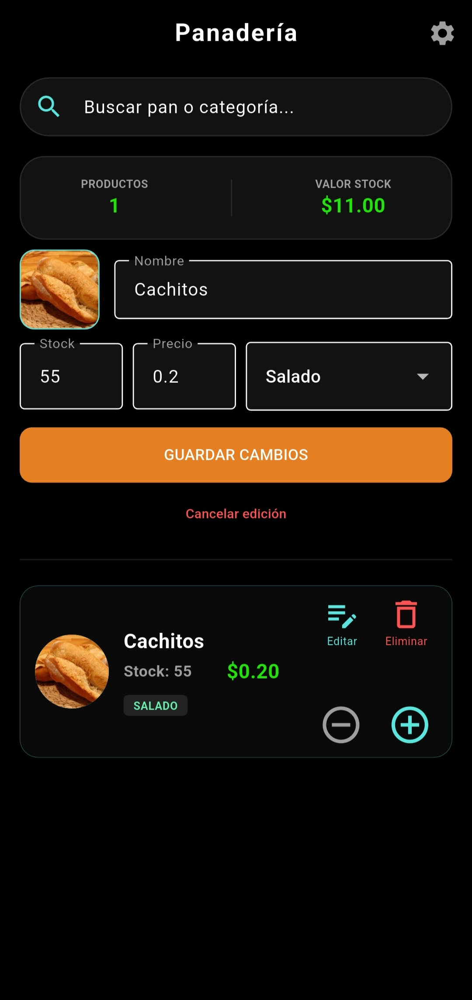
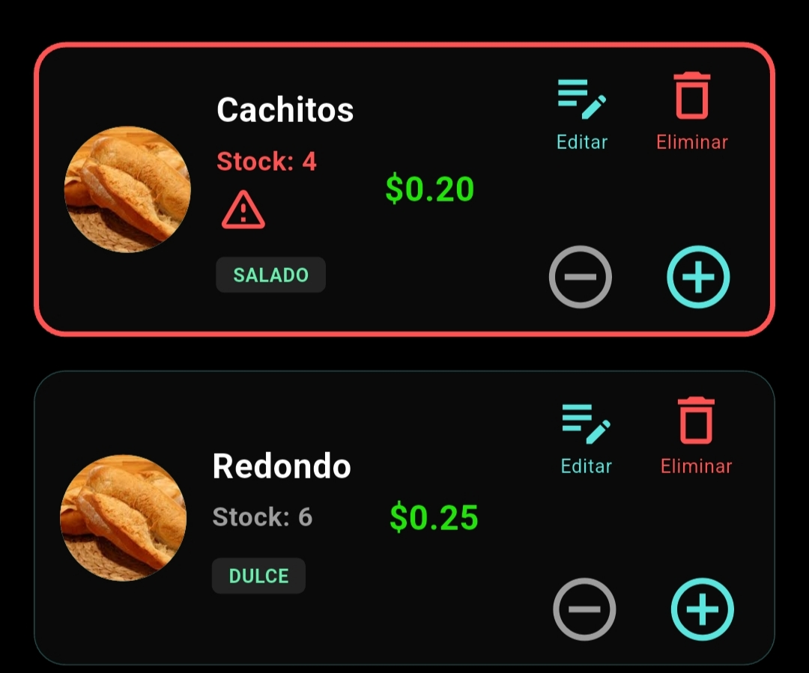
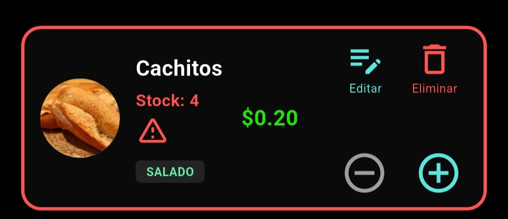
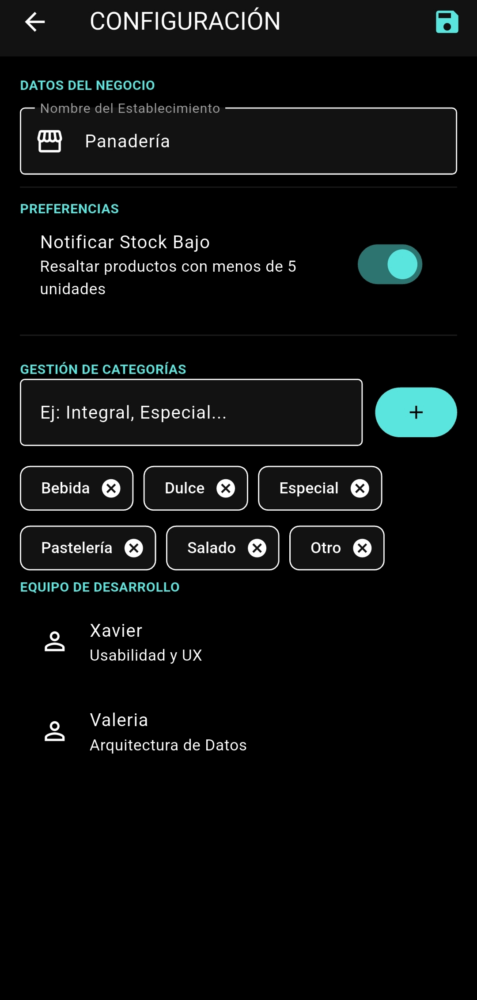

# 🥖 Inventario Panadería (app_inventario)

**Proyecto:** Gestión de Stock y Auditoría de Usabilidad (HCI)  
**Institución:** Universidad Politécnica Estatal del Carchi/ Maestria en ingeniería de software

¡Bienvenidos al repositorio oficial del proyecto! Esta aplicación está diseñada para ayudar a los panaderos a gestionar su producción diaria, controlar el stock de productos (cachitos, pan de bono, etc.) y visualizar precios en tiempo real.

---

## 📱 Vista Previa del Diseño

|     Inicio       | Lista de Productos | Alerta de Stock Bajo | Gestión de Categorías |
| :---: | :---: | :---: |:---: |
|  |  |  |  |

> **Nota:** Las interfaces han sido diseñadas siguiendo las 10 heurísticas de Nielsen y la teoría de carga cognitiva de Sweller para optimizar la eficiencia operativa.

---

## 👥 Equipo y Roles
* **José (Arquitecto / Líder Técnico):** Estructura del proyecto, diseño de base de datos SQLite, liderazgo metodológico y despliegue.
* **Xavier (UI / Frontend):** Diseño de interfaces en Figma, creación de widgets reutilizables y componentes adaptativos.
* **Valeria (Analista / QA):** Definición del backlog, diccionario de datos, auditoría de accesibilidad (WCAG 2.2) y pruebas de calidad.

---
## 📐 Respaldo Metodológico
El desarrollo de **Inventario Panadería** sigue el modelo híbrido **Mobile-D + SCRUM**, optimizando el ciclo de vida móvil con gestión ágil:

1. **Exploración:** Definición de arquitectura (José).
2. **Producción (Sprints):** Desarrollo de pantallas (Xavier) y lógica de inventario (José).
3. **Estabilización:** Pruebas de carga cognitiva y QA (Valeria).

---
## 🛠️ Metodología de Desarrollo
El proyecto se rige bajo el marco de trabajo **Scrum**, con un enfoque en ingeniería de software de alta fidelidad:

1.  **Diseño Centrado en el Usuario (UCD):** Prototipado rápido y validación de flujos.
2.  **Arquitectura de Capas:** Separación estricta entre lógica de negocio, modelos y servicios de datos.
3.  **HCI & Computación Afectiva:** Implementación de interfaces que responden a la frustración del usuario (Proyecto Aura-UI).

---

## 🏗️ Estructura del Proyecto

Para mantener el código limpio y escalable, utilizamos la siguiente jerarquía:

* `lib/models/`: Definición de clases de datos (ej: `Producto.dart`).
* `lib/screens/`: Pantallas principales (Inventario, Registro, Detalles).
* `lib/services/`: Lógica de la base de datos SQLite y `DatabaseHelper`.

---

## 🚀 Guía de Inicio para el Equipo

### 1. Clonación y Dependencias
Primero, clona el repositorio y descarga los paquetes necesarios:
```bash
git clone [https://github.com/tu-usuario/app_inventario.git](https://github.com/josstapia/App_Inventario.git)
cd app_inventario
flutter pub get